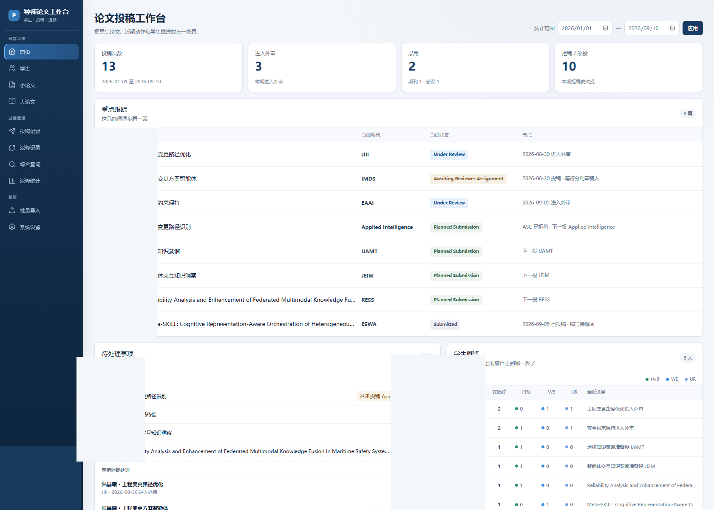
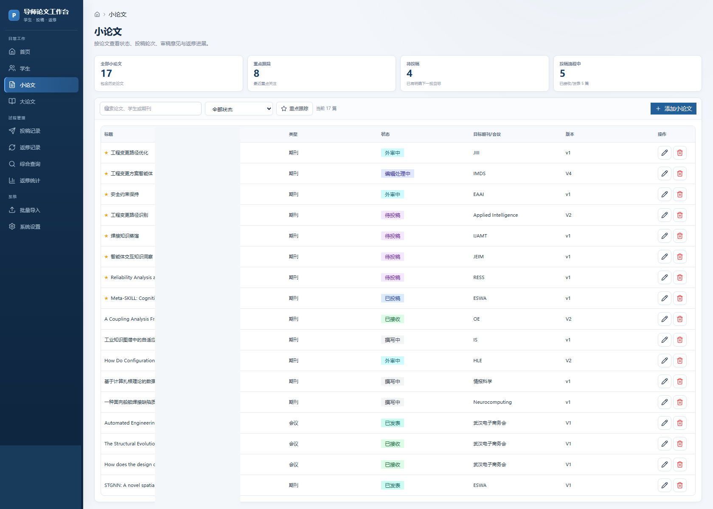
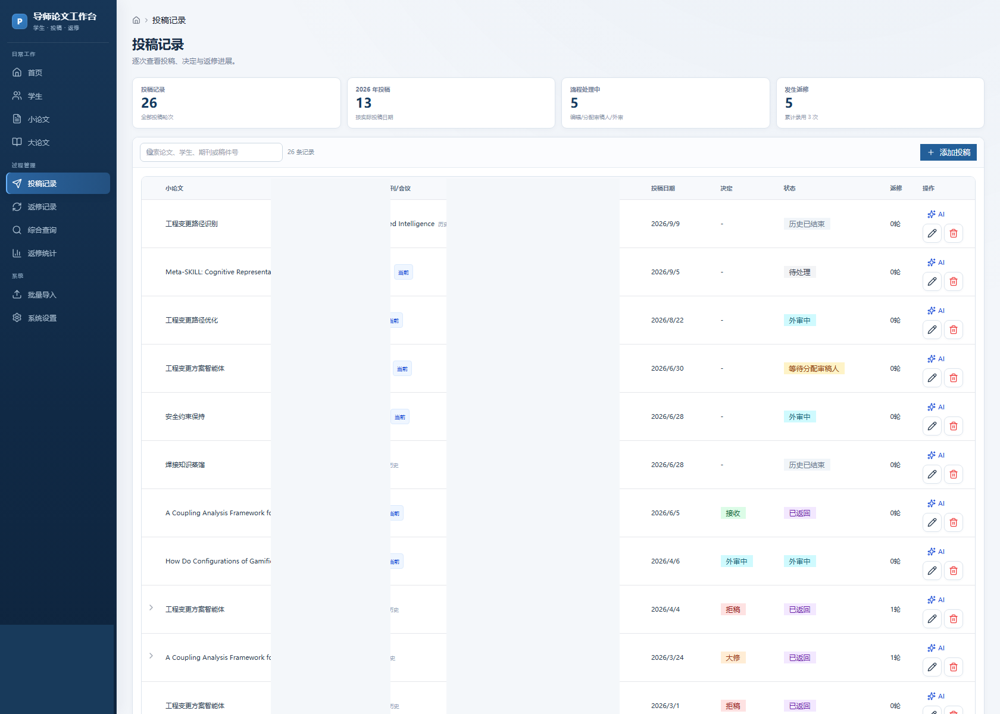

# 导师论文工作台（PlatStuPaperManage）

面向高校导师的学生论文与投稿过程管理平台。用于集中管理学生、论文、投稿、返修、学位论文、附件与阶段进展，并提供不依赖模型 API 的外部 AI 协作工作流。

> 当前版本：R19 / `0.19.0`
> 推荐环境：Windows + Node.js 22+

## 为什么做这个项目

论文管理真正困难的不是“存一张表”，而是长期跟踪一篇稿件在不同期刊、不同投稿轮次、返修和录用之间的完整过程，同时还要保留历史责任人、附件、审稿意见和当前状态。

PlatStuPaperManage 把这些过程统一到一个本地工作台中，避免用多个 Excel、聊天记录和文件夹分散维护。

## 界面预览

以下截图来自真实运行界面，姓名、账户信息及内部投稿信息均已脱敏。

### 首页工作台



首页集中展示统计卡片、重点跟踪、待处理事项、外部处理中稿件和学生概览。统计卡片可作为筛选入口；重点稿件按当前投稿状态显示，不会把历史投稿轮次误当成当前状态。

### 小论文管理



统一查看论文状态、目标期刊或会议、版本与重点跟踪标记，并进入具体论文详情。

### 投稿记录



每次投稿均独立记录期刊或会议、稿件号、投稿日期、状态、审稿决定和返修历史；当前投稿与历史投稿分开识别。

## 当前支持的投稿状态

平台区分以下常用阶段：

- Planned Submission：准备投稿
- Submitted：已投稿
- With Editor：编辑处理中
- Awaiting Reviewer Assignment：等待分配审稿人
- Under Review：外审中
- Minor Revision / Major Revision：小修 / 大修
- Accepted / Published：录用 / 已发表
- Rejected / Decisioned：已返回决定或已拒稿

状态计算以“当前有效投稿”为核心，不再简单依赖投稿轮次编号，因此可以正确处理跨期刊改投后重新从第 1 轮开始的情况。

## 主要功能

- 多教师注册、登录与数据隔离
- 学生、小论文、学位论文全过程管理
- 投稿轮次、稿件号、编辑状态、外审状态和审稿决定
- 多轮返修、回复信与返修历史追踪
- 当前投稿与历史投稿自动区分
- 首页重点跟踪与待处理事项
- 学生概览：Accepted、待投、Submitted、With Editor、待分配审稿人、Under Review
- 可点击统计卡片与条件筛选
- 论文责任交接与历史责任保留
- 英文题名、第一作者、通讯作者按投稿轮次保存
- 投稿文件、补充材料和历史附件追溯
- 综合查询、投稿统计与返修分析
- 批量导入
- 外部 AI 任务包工作流，不绑定具体模型或供应商

## AI 协作方式

平台默认不要求 Token 或模型 API。教师可从投稿记录或返修记录进入 AI 辅助，选择并编辑提示词模板，将论文元数据、编辑决定、审稿意见、返修历史、投稿历史、责任交接和附件清单组合成一个可复制或导出的任务包。

内置任务覆盖审稿意见结构化、返修任务规划、回复信草稿、返修完成度检查、拒稿后改投分析以及英文题名与摘要优化。外部模型输出可以贴回平台保存，并保留当次实际提示词和任务上下文。

## Windows 快速开始

要求：Node.js 22 或更高版本。

首次安装：

```bat
install_windows.cmd
```

日常启动：

```bat
start_windows.cmd
```

然后访问：

```text
http://127.0.0.1:3000
```

## 本地开发

```bash
npm ci
npm run setup
npm run dev
```

生产构建：

```bash
npm ci
npm run build
npm start
```

完整验证：

```bash
npm run verify:all
npm run typecheck
npm run build
```

## 数据与隐私

本地数据库位于 `prisma/data/dev.db`，运行期附件和密钥位于 `data/`。这些目录中的个人数据、附件、认证密钥和本地数据库不应提交到公开仓库；项目 `.gitignore` 已默认排除相关运行数据。

仓库中的界面截图仅用于展示产品能力，已对姓名、账户信息、稿件号和其他内部投稿信息进行脱敏处理。公开仓库不应包含真实学生姓名、学号、投稿编号、数据库文件、附件原件、浏览器 profile 或验收过程文件。

## 技术栈

Next.js 14 · React 18 · TypeScript · Prisma 5 · SQLite · Tailwind CSS
